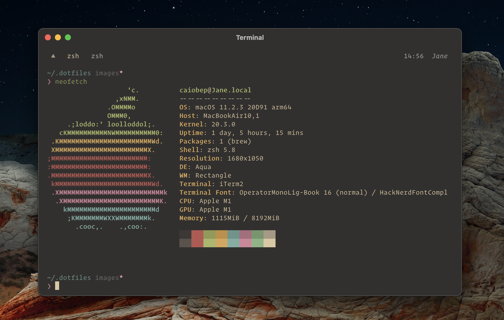

# Dotfiles

> Yet another multiplatform dotfiles setup using **tmux vim and zsh**

## Installation

Fist clone the repository in your home folder by doing

`git clone https://github.com/caiobep/.dotfiles ~/.dotfiles`

Then install it by running

`sudo chmod +x ~/.dotfiles/install.sh && ~/.dotfiles/install.sh`

To install VIM plugins, simply open vim using the vim command and then run :PlugInstall

That's it :)

## Description

This terminal setup was design to be very modular, for that reason every configuration file stays at `~/.dotfiles`. This way you can have enviroment specific variables for each place you use it, by changing the configuration at your home folder.

For exemple, if you need to use proxy variables on your work, you could simply add http_proxy environment variables to your `$HOME/.zshrc` file, without affecting your main setup configuration. The same happen for **tmux** and **vim**. This way your environment specific settings will stay safe and will not intervene on other setups.
